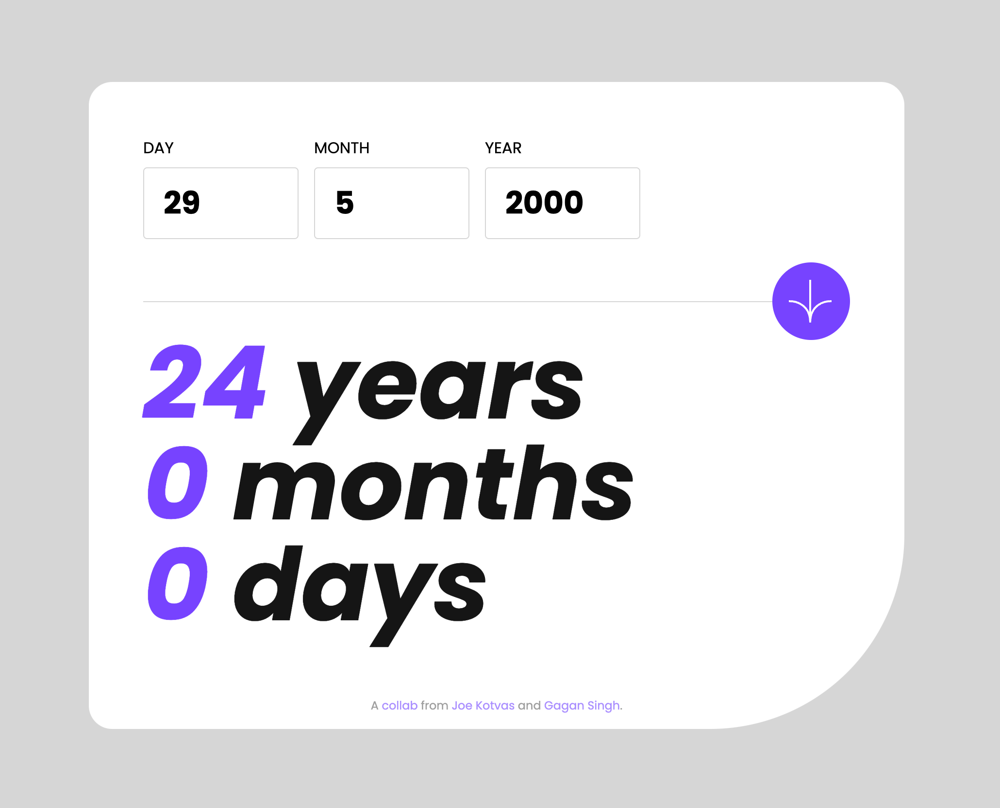

# Frontend Mentor - Age calculator app solution

This is a solution to the [Age calculator app challenge on Frontend Mentor](https://www.frontendmentor.io/challenges/age-calculator-app-dF9DFFpj-Q). Frontend Mentor challenges help you improve your coding skills by building realistic projects. The project was undertaken as a [Chingu](https://chingu.io) pair programming collab, and completed over several sessions. Chingu is a community that brings together dedicated professionals to collaborate on team projects.

## Table of contents

- [Overview](#overview)
  - [The challenge](#the-challenge)
  - [Screenshot](#screenshot)
  - [Links](#links)
  - [Built With](#built-with)
- [Authors](#authors)
- [Acknowledgments](#acknowledgments)

## Overview

### The challenge

Users should be able to:

- View an age in years, months, and days after submitting a valid date through the form
- Receive validation errors if:
  - Any field is empty when the form is submitted
  - The day number is not between 1-31
  - The month number is not between 1-12
  - The year is in the future
  - The date is invalid e.g. 31/04/1991 (there are 30 days in April)
- View the optimal layout for the interface depending on their device's screen size
- See hover and focus states for all interactive elements on the page

### Screenshot

### Links

- Solution: [Github Repo](https://github.com/joekotvas/age-calculator-joe-gagan)
- Live Site: [Age Calculator](https://age-calculator-joe-gagan.netlify.app/)

### Built With

- [React](https://reactjs.org/) - JS Library
- [Vite](https://vitejs.dev/) - React Build Tool
- [date-fns](https://date-fns.org/) - JS Library for Date Manipulation
- [Tailwind CSS](https://tailwindcss.com/) - For Styles
- [Netlify](https://www.netlify.com/) - CI/CD Hosting

## Authors

### Joe Kotvas

Joe is a front-end developer and UX specialist who has been building client sites for over a decade. He is passionate about creating beautiful, user-friendly websites that help businesses grow. Joe is a lifelong learner who is always looking for new ways to improve his skills and stay up-to-date with the latest trends in web development.

- Agency - [Jokma Web Solutions](https://jokma.com)
- Frontend Mentor - [@joekotvas](https://www.frontendmentor.io/profile/joekotvas)
- GitHub - [@joekotvas](https://www.github.com/joekotvas)

### Gagandeep Singh

Gagan is a full-stack web developer currently pursuing his masters in applied computing. He has experience working with a variety of technologies, including JavaScript, Python, and Java. Gagan is passionate about building high-quality software that solves real-world problems. He is always looking for new challenges and opportunities to learn and grow as a developer.

- Portfolio - [Gagandeep Singh](https://gagansingh5.github.io/portfolio/)
- GitHub - [@gagansingh5](https://github.com/GaganSingh5)
- LinkedIn - [Gagandeep Singh](https://www.linkedin.com/in/gagansingh5/)

## Acknowledgments

Many thanks to Frontend Mentor and Chingu for their roles in this project. [Frontend Mentor](https://www.frontendmentor.io/) challenges help you improve your coding skills by building realistic projects. [Chingu](https://chingu.io) brings together dedicated professionals to collaborate on team projects.
